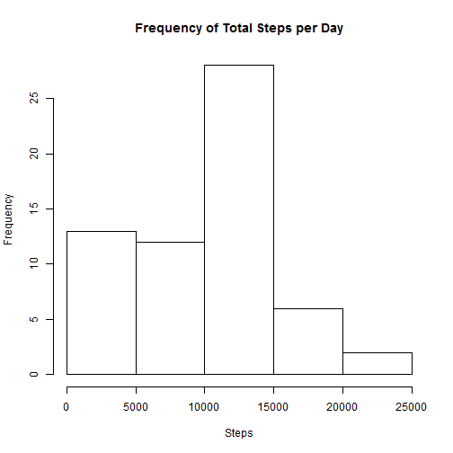
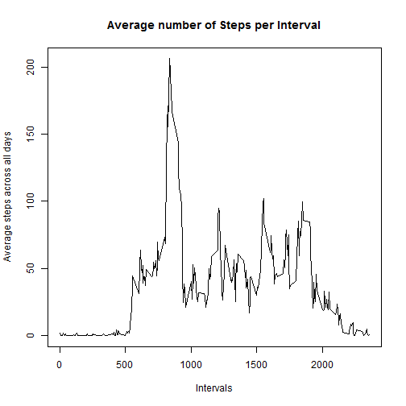
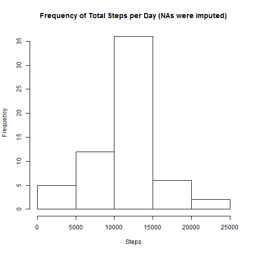
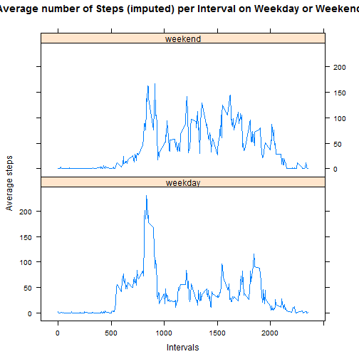

# Reproducible Research
# Peer Assessment 1

# Loading the data

```r
ActivityData<-read.csv("activity.csv")
```
# What is mean total number of steps taken per day?
The histogram and the mean and median of the total number of steps taken each day
(the missing values are ignored in the dataset)

```r
TotalStepsPerDay <- aggregate(ActivityData$steps, list(date=ActivityData$date), FUN=sum, na.rm=TRUE)

hist(TotalStepsPerDay$x, xlab = "Steps", ylab = "Frequency", 
     main = "Frequency of Total Steps per Day")
```

 

```r
StepsMean <- mean(TotalStepsPerDay$x)
StepsMean
```

```
## [1] 9354.23
```

```r
StepsMeadian <- median(TotalStepsPerDay$x)
StepsMeadian
```

```
## [1] 10395
```
# What is the average daily activity pattern?
The plot of the mean total number of steps per interval across all days.

```r
TotalStepsPerInterval<- aggregate(ActivityData$steps, list(interval=ActivityData$interval), FUN=mean, na.rm=TRUE) 
plot(TotalStepsPerInterval$interval, TotalStepsPerInterval$x, type="l",
    xlab = "Intervals", ylab = "Average steps across all days", 
    main = "Average number of Steps per Interval")
```

 

The 5-minute interval, on average across all the days in the dataset, 
which contains the maximum number of steps.

```r
StepsMaxAvg <-max(TotalStepsPerInterval$x)
IntervalMaxSteps <- TotalStepsPerInterval[TotalStepsPerInterval$x == StepsMaxAvg,1]
IntervalMaxSteps
```

```
## [1] 835
```
The 5-minute interval 835 contains the maximum number of steps.


# Imputing missing values

The total number of missing values (i.e. the total number of rows with NAs) in the dataset

```r
TotalNASteps <- sum(is.na(ActivityData$steps))
TotalNASteps
```

```
## [1] 2304
```
There are 2304 missing values in the steps column of the dataset.

The new dataset ImputeActivityData, where the all of the missing values 
in the original dataset are filled using the mean for that interval 
i.e using former values from TotalStepsPerInterval by new function fill.

```r
ImputeActivityData <- ActivityData

fill <- function (steps, interval) {
    if (is.na(steps)) {
       TotalStepsPerInterval[TotalStepsPerInterval$interval == interval, 2] 
    } else {
       steps
    }
}

StepsImpute<-mapply(fill, 
    ImputeActivityData$steps,ImputeActivityData$interval)

ImputeActivityData$steps <- StepsImpute

ImputeTotalStepsPerDay <- aggregate(ImputeActivityData$steps, 
    list(date=ImputeActivityData$date), FUN=sum)
```
The histogram of the new dataset ie. the total number of steps taken each day.
The missing values of the original dataset have been replaced the mean for that interval. 

```r
hist(ImputeTotalStepsPerDay$x, xlab = "Steps", ylab = "Frequency", 
     main = "Frequency of Total Steps per Day (NAs were imputed)")
```

 

The mean of the total number of steps taken each day (NAs were imputed).

```r
ImputeStepsMean <- mean(ImputeTotalStepsPerDay$x)
ImputeStepsMean
```

```
## [1] 10766.19
```
The median of the total number of steps taken each day (NAs were imputed).

```r
ImputeStepsMeadian <- median(ImputeTotalStepsPerDay$x)
ImputeStepsMeadian
```

```
## [1] 10766.19
```
These values differ significantly from the estimates from the first part of the assignment, 
particularly the mean. So, the impact of imputing missing data using mean was not so good 
in this situation.

# Are there differences in activity patterns between weekdays and weekends?

The new factor variable "daytype" in the dataset with two levels - "weekday" and "weekend",
that indicates whether a given date is a weekday or weekend day.
The dataset with the filled-in missing values i.e ImputeActivityData is used in this part.


```r
WeekActivityData <- ImputeActivityData
WeekActivityData$weekday <- weekdays(as.Date(WeekActivityData$date))

daytype <- function (day) {
    if (day == "Sunday" || day == "Saturday") {
       "weekend"
    } else {
       "weekday"
    }
} 

WeekActivityData$daytype <- mapply(daytype, WeekActivityData$weekday)
```

The panel plot containing a time series plot of the 5-minute interval (x-axis) 
and the average number of steps taken, averaged across all weekday days or 
weekend days (y-axis). 


```r
WeekActivityPerDaytype <- aggregate(WeekActivityData$steps, 
    list(interval=WeekActivityData$interval, daytype=WeekActivityData$daytype), FUN=mean)

library("lattice")

xyplot(x~interval|daytype, data = WeekActivityPerDaytype, type = "l", layout = c(1,2),
    xlab = "Intervals", ylab = "Average steps ", 
     main = "Average number of Steps (imputed) per Interval on Weekday or Weekend") 
```

 


